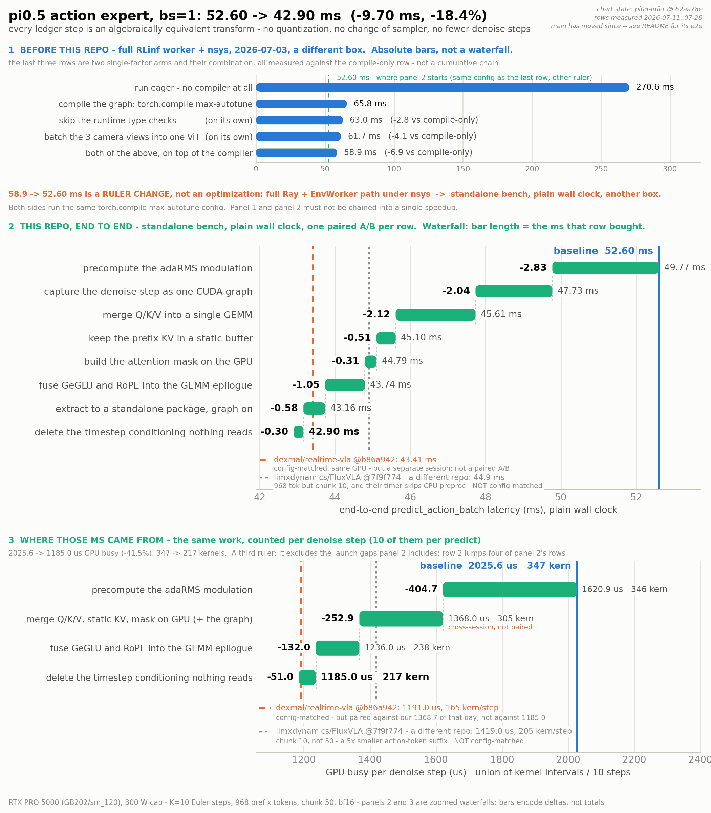

**English** | [简体中文](README.zh-CN.md)

# pi05-infer

**A standalone bs=1 inference engine for the π0.5 action expert**, extracted from
[RLinf](https://github.com/RLinf/RLinf) and systematically optimized for the
**RTX PRO 5000 (GB202 / sm_120, Blackwell)**.
**No precision reduction, no approximation** — every item is an algebraically equivalent
transform: no quantization, no change of sampler, no reduction in the number of
denoising steps.

> **Further reading** (both documents are written in Chinese) —
> **[`opt.md`](opt.md)**: the complete optimization record (the three phases, the
> line-by-line ledger with footnotes, why/how/how-much for each item in §①/②/③,
> the correctness argument, the measurement methodology, the traps we fell into and the
> approaches we explicitly ruled out);
> **[`docs/MEASUREMENTS.md`](docs/MEASUREMENTS.md)**: the raw per-A/B measurement archive;
> **[`EXTRACTION_NOTES.md`](EXTRACTION_NOTES.md)**: the extraction boundary against RLinf
> and what is still outstanding.

## Results

End-to-end `predict_action_batch`: **52.60 ms → 42.90 ms (−9.70 ms, −18.4 %)**,
against a `torch.compile max-autotune` baseline.

<picture>
  <source media="(prefers-color-scheme: dark)" srcset="docs/ledger_dark.png">
  
</picture>

The three panels are measured with **three different rulers and must not be chained
end to end**:

* **Panel 1: before this repository started.** Measured under a different protocol —
  the full RLinf worker under nsys. `torch.compile` on its own is worth 4.1×
  (270.6 → 65.8 ms), the single largest lever anywhere — but the
  **6 ms from 58.9 to 52.60 is a change of ruler, not an optimization**.
* **Panel 2: this repository's end-to-end ledger.** Plain wall clock from the standalone
  bench, one paired A/B per row. 52.60 → 42.90 ms — the headline number above.
* **Panel 3: the same optimizations, accounted per denoising step.** GPU busy
  2025.6 → 1185.0 µs/step, kernel count 347 → 217. This panel is where panel 2's
  milliseconds actually come from.

The two dashed lines mark where reference implementations sit. Neither is a paired
measurement and no win/loss is claimed from them; the breakdown is in
[opt.md](opt.md#s-baselines).

Five more items landed after the ledger was closed. **Their absolute baselines come from
different sessions (some with locked clocks, some without), so they are not part of the
52.60 → 42.90 paired chain and do not appear in the chart — do not add them onto 42.90:**

| Optimization | Gain | Commit | Details |
|---|--:|---|---|
| Small-`M` mm tile candidates (`down_proj` / `o_proj`) | **−0.88 ms/predict** | `ca4ae39` | [opt.md §3.1](opt.md#s-3-1) |
| Skip the dead compute in the prefix LM's last layer ⚠️ conditionally installed | **−1.11 ms/predict** (conservative accounting) | `72af442` | [opt.md](opt.md#s-after-ledger) |
| Retile the P·V attention `bmm` | **−0.18 ms/predict** | `ff237bf` | [opt.md §3.2b](opt.md#s-3-2b) |
| Hoist the step-invariant work out of the denoise loop | **−0.32 ± 0.05 ms/predict** | `0ed3ca2` | [below](#r-hoist) |
| Merge the prefix LM's Q/K/V projections into one GEMM | **−0.61 ± 0.22 ms/predict** | `d7cf3c2` | [below](#r-prefix-qkv) |

<a id="r-hoist"></a>

### Hoisting the step-invariant work out of the denoise loop (−0.32 ms)

The 4-D attention mask, the position ids
(`sum(prefix_pad_masks) + cumsum(suffix_pad_masks) − 1`) and the RoPE cos/sin table are
byte-identical on all 10 Euler steps — `suffix_pad_masks` is an all-ones constant and
`prefix_pad_masks` is fixed for the whole predict — yet they were being rebuilt on every
step, and inductor was materializing 32 copies of the `[1, 50, 256]` cos/sin table per
step (one per consumer layer, because the fused QKV+RoPE kernel is an opaque custom op).
They are now built **once per predict** into persistent buffers, in the same slot and for
the same reason as the adaRMS modulation table: the construction is eager and must stay
outside the CUDA-graph capture, while its output buffers must exist before the capture so
that the graph records their addresses. The buffers are refilled with `copy_` and never
reallocated.

Measured (nsys 2026.1.2, 4 alternating paired rounds, SM clock locked at 2302 MHz):

```
denoise  stream 157   217.00 -> 190.00 kernels/step,  1202.68 -> 1165.32 us/step
prefix   stream 7     +27 kernels/predict, +36.2 us/predict   (the once-per-predict rebuild)
e2e                   43.93 -> 43.61 ms,  -0.32 +- 0.05 ms,  4/4 rounds same sign
```

**Bit-exact** at the kernel level: eager vs. inductor-compiled cos/sin at the production
shapes differ by `0.00e+00` (0 of 12800 elements), as do the mask and the position ids.
Kill switch: `RLINF_HOIST_STEP_INVARIANTS=0`.

<a id="r-prefix-qkv"></a>

### One GEMM for the prefix LM's Q/K/V (−0.61 ms)

The three projections read the same activation, so they are merged into a single
`[2560, 2048]` GEMM followed by a split — on **17 of the 18 layers**. The KV-only last
layer (owned by `prefix_last_layer.py`) keeps its two separate GEMMs, because `cat[k, v]`
there is *not* bit-exact.

**The reason this pays off on the prefix is not the reason it pays off on the denoise
side — do not reuse that argument.** On the expert (M = 50) the mechanism is occupancy
collapse: k/v produce only 50×256 outputs, Triton lands on grid = 8, and 8 of 110 SMs do
any work at all. The prefix has M = 968 and is **not** short of parallelism — its k/v GEMM
runs **248 CTAs**, the machine is full. It is slow because **N = 256 is too narrow to
amortize the traffic of the A operand**: inductor's champion tile walks **2048 steps of K
to produce 1024 output elements**, and lands at **41 TFLOP/s against the MLP's 188**.
k+v are **0.9 % of the LM's FLOPs but 3.3 % of its kernel time**. Widening N from 256 to
2560 puts k and v inside tiles whose A traffic has already been paid for.

Measured after the vendoring boundary was restored (see
[Repository layout](#r-layout)), nsys 2026.1.2, 12 predicts, SM clock pinned at 2092 MHz:

```
prefix   stream 7     23762.2 -> 23091.2 us/predict   -671.0 us   (633 -> 616 kernels)
denoise  stream 157   1630 kernels on both arms, launch delta 0,  -0.02% (noise)
SigLIP   stream 158   383 kernels on both arms, unchanged
e2e paired A/B, 12 rounds, clocks pinned:   -0.61 +- 0.22 ms   (t = -2.75, 9/12 same sign)
```

The nsys kernel time (−671 µs) is the number we stand behind; the e2e figure is corroborating
evidence on a ~0.8 ms sd noise floor.

**Bit-identical on the compiled path**, and with a strong criterion: with the arms at
0 fused layers vs. 17 fused layers, all **36 prefix KV tensors match at `0.00e+00`** and the
combined digest is identical — the same tier as skipping the prefix LM's last layer.
Kill switch: `RLINF_FUSE_PREFIX_QKV=0`.

### Measured and rejected: GeGLU epilogue fusion on the prefix

Fusing `gelu_tanh(gate) * up` into the GEMM epilogue works on the denoise side, and
**does not work on the prefix. It is not shipped.** The prefix's gate/up GEMM already runs
at **188 TFLOP/s ≈ 92 % of the achievable cuBLAS peak for that shape**; fusing an epilogue
onto it means moving it off cutlass and onto Triton, and Triton is **6.3 % slower on this
shape (+44 µs/layer)** while the pointwise op being fused away is only worth **28 µs/layer**.
**The entry fee is larger than the prize** — measured twice, a loss both times.
(Contrast the denoise side, where Triton was already 9 % *faster* than cuBLAS and the entry
fee was therefore negative.)

## One-page overview

Two families of optimization were applied to a single π0.5 inference pass —
**elimination** (removing GPU idle time and work whose result is never read) and
**fusion** (merging operators to cut memory round-trips). On an RTX PRO 5000 (GB202) at
bs = 1, K = 10 steps, 968 prefix tokens, bf16, end-to-end latency drops from
**52.60 ms to 42.90 ms, an 18.4 % speedup**, with the numerics preserved, without any
quantization or precision reduction, and without touching algorithm-level settings such as
the number of sampling steps.

**Elimination, −5.99 ms total**

* **Precompute the adaRMS modulation.** Because the denoising schedule is fixed, the
  37 conditioning projections see exactly the same input on every step, so the whole thing
  can be precomputed into a table and indexed by step. The corresponding kernel instances
  drop from 300 to 0. **−2.83 ms**
* **Capture the entire denoise step as one CUDA graph.** `torch.compile` only wraps the
  compiled subgraph; the loop still contains ~70 kernels/step of eager glue that Python
  launches one at a time. Recording the whole step (compiled region plus glue) once and
  replaying it per step cuts GPU idle from 142 µs to 60 µs with GPU busy unchanged.
  **−2.04 ms**
* **Stop re-transferring data that never changes.** The prefix KV and the attention mask
  are identical across all 10 steps, yet they were being re-concatenated and re-uploaded
  from the host every step. They now live in resident static buffers and are constructed
  directly on the GPU. **−0.82 ms**
* **Delete dead code.** The timestep conditioning branch's result is never consumed
  downstream, so it goes — together with its sinusoidal embedding and both time-MLP GEMMs.
  **−0.30 ms**

**Fusion, −3.17 ms total**

* **Merge the Q/K/V projections into one GEMM.** All three read the same input, so doing
  them separately reads it from memory three times. The weights are concatenated into a
  single `[2560, 1024]` matrix and read once. **−2.12 ms**
* **Fuse SwiGLU and RoPE into GEMM epilogues.** Gate and up likewise share one activation,
  and their 4096-wide intermediate is consumed immediately after it is produced — there is
  no reason to spill it to memory and read it back. RoPE needs values from `d` and `d+128`
  within the same tile, which the compiler's tile model cannot express. Both therefore have
  to be hand-written. Kernels per step drop from 305 to 238.
  **−1.05 ms combined (measured as a pair)**

The third phase, "make the remaining kernels faster", is in progress; what has landed so
far is in [opt.md](opt.md).

("Numerics preserved" above means **no precision reduction and no approximation**; it is a
different claim from "bit-identical" in
[Two tiers of numerical agreement](#r-numerics) below.)

<a id="r-config"></a>

## Configuration (every number here was measured under it)

π0.5, batch 1, **K = 10** Euler denoising steps, **968 prefix tokens**
(3 camera views × 256 patches + 200 language tokens), action chunk 50, **bf16 throughout**.
The action expert is gemma_300m: 18 layers, d = 1024, mlp 4096, 8 query heads / 1 KV head
(MQA), head_dim 256, 50 action tokens.
Machine: RTX PRO 5000 72 GB Blackwell, GB202, sm_120, 110 SMs, 1344 GB/s,
**300 W power cap**. Checkpoint `RLinf-Pi05-LIBERO-SFT`, torch 2.7.1+cu128, nsys 2026.1.2.

---

## Two qualifiers that must always travel with the numbers

<a id="r-numerics"></a>

### Two tiers of numerical agreement

**Algebraic equivalence** and **bit-identical output on the compiled path that ships** are
two different claims, and this repository keeps them apart:

* **Algebraic equivalence — holds for every optimization.** Not one of them computes the
  wrong thing.
* **Bit-identical on the `max-autotune` path, under a strong criterion**
  (kernel-level / tensor-level / GEMM-level / same-process): device-side `att_masks`,
  the GEMM epilogue fusions, the small-`M` retile, the P·V `bmm` retile, hoisting the
  step-invariant work, the fused prefix QKV, skipping the prefix LM's last layer, and the
  extraction from RLinf itself. Two further items — deleting the dead timestep conditioning
  and the hand-captured denoise CUDA graph — pass only weaker gates, but the conclusion
  holds (what was deleted is provably dead code, and the graph capture is algebraically
  lossless).
* **Bit-identical under eager only, not on the compiled path**: the precomputed adaRMS
  modulation table, the fused Q/K/V GEMM on the expert, and the static prefix-KV buffer.
  Under `max-autotune` each produces an action delta of **2.4–2.9e-3** (≈ 1 % of the action
  magnitude). The mechanism is that **two spellings of the same algebraic expression get
  compiled by inductor into different kernels** — change a shape and it picks a different
  tile and a different fp32 accumulation split along K, i.e. a different floating-point
  rounding order. **This is neither a numerical error nor a loss of precision.**
  The three-way SigLIP batching from the prehistory is in the same category: mathematically
  identical, bit-different.

⚠️ **Limitation:** those failing items were **not re-run under `--stage1`** (the shipping
configuration). The back-fill ran on base `max-autotune`, so strictly speaking those three
✗ results are established only for base `max-autotune`.

The full evidence table, the FAIL list, the tiering of criteria and the mechanism are in
[opt.md § Correctness](opt.md#s-correctness).

### Skipping the prefix LM's last layer is **conditionally installed**

Not every deployment gets that −1.11 ms. RLinf's `get_value_from_vlm(prefix_output)` reads
exactly the hidden state that gets skipped, so `install_skip_last_lm_layer()` **declines to
install** whenever it detects a VLM value head (`value_after_vlm and add_value_head`).
Of the **19 published pi0.5 PPO configurations, 15 hit that condition** (→ they do not get
the 1.11 ms); the other 4, plus the DSRL / SAC ones, do install it. `pi05-infer` is a
pure-inference package with no value head, so it is on by default here.
Kill switch: `RLINF_SKIP_LAST_LM_LAYER=0`.

---

## Install and run

Use the existing RLinf benchmark container image — **no Docker rebuild required**. Install
editable and with `--no-deps`, so that the torch / transformers / openpi versions pinned
inside the container are left alone:

```bash
docker exec -w /path/to/pi05-infer pi05bench \
    /opt/venv/openpi/bin/pip install -e . --no-deps --no-build-isolation

# benchmark
/opt/venv/openpi/bin/python bench/standalone_infer_bench.py \
    --model-path /path/to/RLinf-Pi05-LIBERO-SFT --config-name pi05_turtle --iters 30
... --stage1        # enable the hand-captured denoise CUDA graph (opt-in; every number
                    # from ledger row 7 onwards was measured with it on)
... --phases        # per-phase timing
... --dump-actions /tmp/a.pt --clocks-json /tmp/clocks.json   # numerical A/B + SM clock/power
```

`pi05-infer` does not touch `site-packages`; it only adds one path entry, so the container
stays pristine and can serve as the reference arm of an A/B. Custom ops are registered
under the `pi05_infer::` namespace rather than `rlinf::` — the reason is in
[opt.md](opt.md#s-opnamespace).
`--stage1` rewrites `max-autotune` into `max-autotune-no-cudagraphs` and asserts after
warmup that the graph really was captured (otherwise it falls back to the eager loop
**silently**) — see [opt.md](opt.md#s-stage1).

<a id="r-verify"></a>

## Verification: numerical agreement

```bash
# 0. isolation: the expert must be pi05_infer.gemma, the PaliGemma prefix must be transformers
python tools/isolation_check.py          # prints ISOLATION_OK

# 1. kernel level: the two Triton fusion kernels / two small-M GEMMs / two attention bmms /
#    prefix KV / fused prefix QKV
python tools/bitgate.py
python tools/bitexact_denoise_gemms.py
python tools/bitexact_denoise_bmms.py
python tools/bitexact_prefix_kv.py
python tools/bitexact_prefix_qkv.py

# 2. the structural optimizations on the compiled path (frozen prefix + four-process empty
#    control gate), one command per stage
bash tools/run_bitexact_backfill.sh <stage>   # siglip|extraction|prefix|adarms|adarms_eager|qkv|kvstatic|attmask

# 3. end-to-end numerical A/B at a fixed seed — ⚠️ always with an empty control;
#    a single dump on its own proves nothing
GATE_OFF="RLINF_SMALL_M_MM=0" GATE_ON="RLINF_SMALL_M_MM=1" \
  tools/bitexact_gate.sh /tmp/gate_small_m --stage1 --iters 1 --warmup 4
```

`bitexact_gate.sh` **runs four processes** (two per arm) and reports the cross-arm
comparison only when both same-arm empty controls come back clean; otherwise it declares
INCONCLUSIVE and **never** PASS. All four processes share one `TORCHINDUCTOR_CACHE_DIR`, so
that shapes neither arm touched keep the same autotune champion.
The reference-arm comparison is `tools/ab_rlinf_reference.py --dump-actions /tmp/ref.pt`.
Every optimization has a kill switch, and the OFF arm exercises a verified fallback path
([opt.md](opt.md#s-fallback)). What each file under `tools/` does is listed in the
[opt.md appendix](opt.md#s-inventory).

---

<a id="r-layout"></a>

## Repository layout

```
pi05_infer/       the engine itself: engine.py (pure inference orchestration + the
                  hand-captured denoise CUDA graph + the adaRMS modulation table +
                  the hoisted step invariants), builder.py, dataconfig/, _vendored/,
                  gemma/ (the action expert's Gemma fork + two Triton fusion kernels),
                  openpi_patched/, inductor_mm_tiles.py, prefix_last_layer.py,
                  prefix_qkv_fused.py
bench/            standalone_infer_bench.py -- latency bench (e2e, per-phase, nsys, action dumps)
tools/            isolation check; bit-exactness gates at kernel / GEMM / KV level; the
                  four-process end-to-end gate; paired A/B drivers (some with clock locking);
                  profile analysis; an in-process SGLang v0.5.16 pi0.5 bench for head-to-heads
docs/             make_charts.py (regenerates the three charts in this README) + MEASUREMENTS.md
_extract_src/     the original RLinf files before extraction (not refactored)
```

The per-file inventory is in
[opt.md § repository file inventory](opt.md#s-inventory).

`import pi05_infer` routes **only the action expert** through our vendored Gemma; the
PaliGemma **prefix** keeps using stock transformers, and `tools/isolation_check.py` asserts
that boundary module by module. This is not ceremony — a +4 ms regression once came from the
two sharing one copy of the model code; see
[opt.md § prefix / expert isolation](opt.md#s-isolation).
The full description of the boundary is in [`EXTRACTION_NOTES.md`](EXTRACTION_NOTES.md) §8.

The boundary has since been validated the hard way. The GPU box's container had at some
point had its `site-packages/.../modeling_gemma.py` overwritten with an old version of our
fork; it has been restored to the stock file (keeping only openpi's own `use_adarms` patch).
Profiling before and after the restore shows that on the denoise side (stream 157) the
**set of 44 distinct kernels is identical, every kernel's launch count matches one for one,
and the total launch delta is 0** — the expert never depended on the container's fork, so
the vendoring boundary is real. (It also confirms that the `pi05_infer::` op namespace was
never shadowed by `rlinf::`.) The prefix timings were likewise unchanged; what *did* change
is the prefix numerics, and for the better — see the fused prefix QKV above.

---

## Acknowledgements and provenance

This repository vendors the following Apache-2.0 code with annotated modifications:

| Component | Source |
|---|---|
| `pi05_infer/gemma/modeling_gemma.py` | HuggingFace Transformers (Copyright 2024 Google Inc. & HuggingFace Inc.) |
| `pi05_infer/openpi_patched/` | [openpi](https://github.com/Physical-Intelligence/openpi), via the [RLinf/openpi](https://github.com/RLinf/openpi) fork |
| `engine.py` / `builder.py` / `_vendored/` / `dataconfig/` / `bench/` | [RLinf](https://github.com/RLinf/RLinf) |
| `pi05_infer/gemma/rlinf_fused_denoise.py` | written for this project |

The per-file list of modifications is in [`NOTICE`](NOTICE); the license is
[`LICENSE`](LICENSE) (Apache-2.0).
`dexmal/realtime-vla` is referenced and compared against as a peer; none of its code is
reused.
