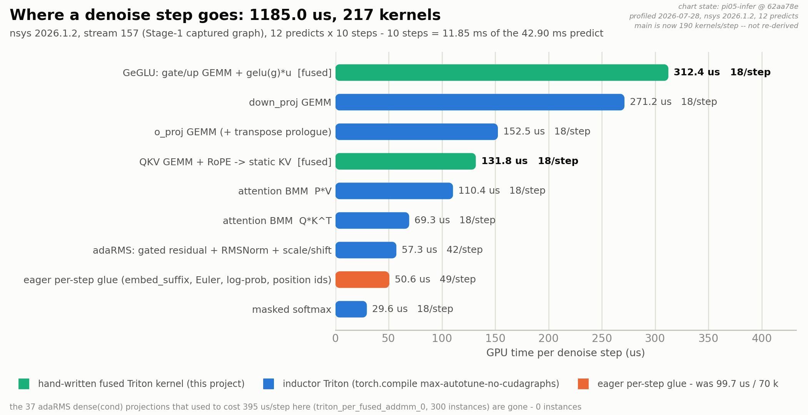
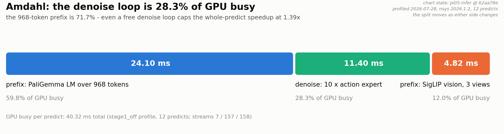

[English](README.md) | **简体中文**

# pi05-infer

**π0.5 动作专家(action expert)的独立 bs=1 推理引擎**,从
[RLinf](https://github.com/RLinf/RLinf) 里抽出来,针对 **RTX PRO 5000(GB202 / sm_120,
Blackwell)** 做过一轮系统性优化。每一项都是代数等价变换 —— **不量化、不换采样器、不减去噪步数**。

## 成果

端到端 `predict_action_batch`,在上面那张卡上:

```
台账(9 步配对 A/B 链,plain wall clock):   52.60 -> 42.90 ms  (-18.4%)
台账之后、各自锁频基线的两项 tile 改动:       -0.73 / -0.11 ms
当前 main,不锁频 plain wall clock,n=30:     40.63 ms(p50;mean 40.56,
                                             39.40 .. 41.47,SM 时钟采样 2235-2265 MHz)
```

**这三行用的是三把不同的尺,不能首尾相接。** 台账是配对链:每一行都是对上一行的
A/B,所以行与行可以相加。两项 tile 改动是台账收口之后落地的,各自对自己的基线、
**锁频**测的,所以 `-0.73` 和 `-0.11` **不能**从 `42.90` 上减。最后一行是唯一一个
描述"你实际跑起来的 main"的数:单进程、不动时钟、plain wall clock。

<picture>
  <source media="(prefers-color-scheme: dark)" srcset="docs/ledger_dark.png">
  
</picture>

三栏用的是**三把不同的尺**:本仓库开始之前的前史(另一套测量口径)、本仓库的端到端配对台账、
以及同样这些优化按一个去噪步记的账。

图里那两条虚线是参考实现的位置 —— **均非配对测量,不作胜负判断**。

<details>
<summary>一个去噪步花在哪里,以及为什么天花板在 prefix</summary>

<picture>
  <source media="(prefers-color-scheme: dark)" srcset="docs/denoise_dark.png">
  
</picture>

<picture>
  <source media="(prefers-color-scheme: dark)" srcset="docs/phases_dark.png">
  
</picture>

两张图都标了自己代表的 commit 与 profile 日期,**都没有对当前 main 重新推导** ——
原因见 `docs/make_charts.py` 里的说明。第二张图是这个项目的上界所在:
**968 token 的 prefix 占 GPU busy 的 71.7%,所以哪怕去噪循环免费,整个 predict 也只能快 1.39×。**

</details>

## 硬件

这里所有的数字、调优结果和验证,都只在**一张卡**上做过:RTX PRO 5000 Blackwell
(GB202 / sm_120),110 SM,96 MB L2,300 W 功耗墙。

**换任何一张别的 GPU,性能结论和 bit-exactness 结论都同时失效** —— 而后半句才是反直觉的那半。
inductor 的 tile 选择是针对这张卡的 roofline 拐点和 SM 数调的,不可迁移是意料之中;
但这里的"bit-identical"指的是**与未打补丁的构建在这张卡上产出的结果逐位相同**,
而未打补丁的构建**在别的卡上会选中另一个 kernel** —— 参照系本身动了,这个声明在那边没有主语。

代码不会拦你。它只警告一次,硬件相关的 tile pin 在非 sm_120 上会自己拒绝安装,
每一项优化都有 `RLINF_*=0` kill switch。引用这里任何一个数之前,请先在你的卡上重跑
[`tools/`](tools/README.md) 里的 gate。

## 安装与运行

你需要一个 checkpoint。已发布的 SFT checkpoint 可以直接用,例如
[`RLinf/RLinf-Pi05-LIBERO-SFT`](https://huggingface.co/RLinf/RLinf-Pi05-LIBERO-SFT):

```bash
huggingface-cli download RLinf/RLinf-Pi05-LIBERO-SFT --local-dir /path/to/RLinf-Pi05-LIBERO-SFT
export PI05_MODEL_PATH=/path/to/RLinf-Pi05-LIBERO-SFT
```

加载器期望的目录结构是 safetensors 分片,加上放在 asset-id 子目录下的 openpi 归一化统计量:

```
RLinf-Pi05-LIBERO-SFT/
  model*.safetensors  (+ model.safetensors.index.json)
  config.json
  <asset_id>/norm_stats.json      # asset_id 来自 --config-name 指定的 TrainConfig
```

用现成的 RLinf benchmark 容器镜像,**不需要重建 Docker**。editable 安装,并且带
`--no-deps`,以免动到容器里钉死的 torch / transformers / openpi:

```bash
docker exec -w /path/to/pi05-infer pi05bench \
    /opt/venv/openpi/bin/pip install -e . --no-deps --no-build-isolation

# 基准测试
/opt/venv/openpi/bin/python bench/standalone_infer_bench.py \
    --model-path $PI05_MODEL_PATH --config-name pi05_turtle --iters 30
... --stage1        # 开启手写的去噪 CUDA 图(opt-in;台账第 7 行之后的数字都开着它测)
... --phases        # 分阶段耗时
... --dump-actions /tmp/a.pt --clocks-json /tmp/clocks.json   # 数值 A/B + SM 时钟/功耗
```

`pi05-infer` 不碰 `site-packages`(只加一条 path entry),所以容器保持原状,可以作为 A/B
的参考臂。

`--stage1` 会把 `max-autotune` 改写成 `max-autotune-no-cudagraphs`,并在 warmup 之后
**断言**图确实捕获成功,没捕获就直接让这次运行失败。这个检查存在的原因是它要抓的失败是隐形的:
shape signature 对不上时会退回 eager 去噪循环,**除了运行时间之外没有任何症状**。

<a id="r-verify"></a>

## 验证:数值一致性

```bash
export PI05_MODEL_PATH=/path/to/RLinf-Pi05-LIBERO-SFT

python tools/isolation_check.py          # expert = pi05_infer.gemma,prefix = transformers

# 核级 / GEMM 级 / KV 级 bit-exact gate
python tools/bitgate.py                  # 两个 Triton 融合核
python tools/bitexact_denoise_gemms.py   # small-M mm 重 tile
python tools/bitexact_denoise_bmms.py    # attention bmm 重 tile + Q·Kᵀ tile 钉死
python tools/bitexact_prefix_kv.py       # prefix 跳最后一层
python tools/bitexact_prefix_qkv.py      # prefix QKV 融合

# 编译路径上的结构性优化(冻结 prefix + 四进程空对照门),一个 stage 一条命令
bash tools/run_bitexact_backfill.sh <stage>   # siglip|extraction|prefix|adarms|adarms_eager|qkv|kvstatic|attmask

# 端到端数值 A/B —— ⚠️ 四进程,必须带空对照;两个同臂对照不干净就判 INCONCLUSIVE,绝不判 PASS
GATE_OFF="RLINF_SMALL_M_MM=0" GATE_ON="RLINF_SMALL_M_MM=1" \
  tools/bitexact_gate.sh /tmp/gate_small_m --stage1 --iters 1 --warmup 4
```

每个 gate 都跑两个臂并各打印一个 digest,两个必须相同。每一项优化都带 kill switch,
OFF 臂走的是被验证过的降级路径。

⚠️ **这里的位一致性是按编译路径分层的,并没有被无条件声明。** 有些项在 eager 下逐位相同,
在实际发布用的 `max-autotune` 下并不 —— 而 `max-autotune` 自己的 kernel 选择在冷 autotune
之间就不稳定:在某个 shape 上,4 次冷缓存里有 1 次选了 cuBLAS 而不是 Triton 模板,
两者 digest 不同。**对每一项都无条件成立的说法是:变换是代数等价的。**
细节见 `pi05_infer/inductor_mm_tiles.py` 里的 bit-exactness 说明 ——
那里记录了一条本项目**曾经相信、已经发布、后来被实测推翻**的规则。

<a id="r-layout"></a>

## 仓库结构

```
pi05_infer/    引擎本体(engine.py、vendoring 的动作专家 Gemma + Triton 融合核、
               prefix_last_layer.py、prefix_qkv_fused.py、inductor_mm_tiles.py)
bench/         standalone_infer_bench.py —— 延迟基准
tools/         验证 gate 与测量驱动 —— 见 tools/README.md
docs/          上面那些图,以及重新生成它们的 make_charts.py
_extract_src/  抽取前的 RLinf 原始文件
```

`import pi05_infer` 只让**动作专家**走我们 vendoring 的 Gemma,PaliGemma 的 **prefix** 仍用
原厂 transformers。这条缝是刻意留的:它是"去噪核的改动够不着 968 token 的 prefix"这件事的保证。

**`_extract_src/` 不是包的一部分** —— 没有任何代码 import 它,它被排除在构建和 lint 之外。
它是 `pi05_infer/` 抽取时所依据的、未经修改的 RLinf 源码,留在树里是为了让整个抽取
**可以用 diff 审计,而不必信我们一句话**。它没有被重构,也不打算被重构;
逐文件的改动说明见 `EXTRACTION_NOTES.md`。

## 延伸阅读

> **详细的优化记录尚未发布。** 逐项推导、正确性论证、测量方法学与原始 A/B 存档
> 暂存内部,等这部分工作收敛后再一并发布。源码里凡是按名字引用这些文档的地方,
> 那个名字是**出处标注,不是链接**。

* **[`EXTRACTION_NOTES.md`](EXTRACTION_NOTES.md)** —— 从 RLinf 抽取的边界与遗留项。
* **[`tools/README.md`](tools/README.md)** —— 哪些脚本是可移植的,哪些不是。

## 许可证与来源

Apache-2.0([`LICENSE`](LICENSE))。本仓库 vendored 了 HuggingFace Transformers、
[openpi](https://github.com/Physical-Intelligence/openpi)(经
[RLinf/openpi](https://github.com/RLinf/openpi) fork)与
[RLinf](https://github.com/RLinf/RLinf) 的代码,逐文件的修改清单见 [`NOTICE`](NOTICE)。
`dexmal/realtime-vla` 作为 peer 被引用,未复用其代码。
